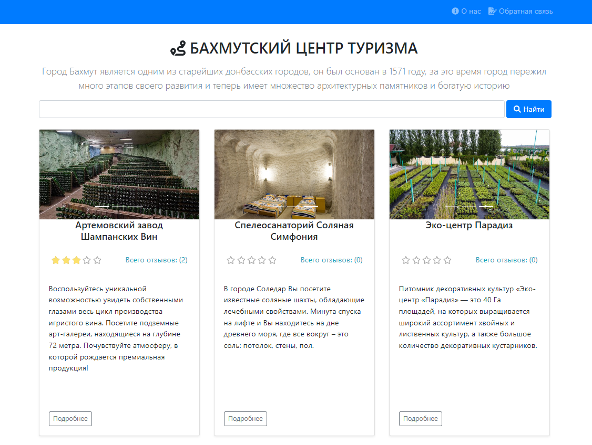
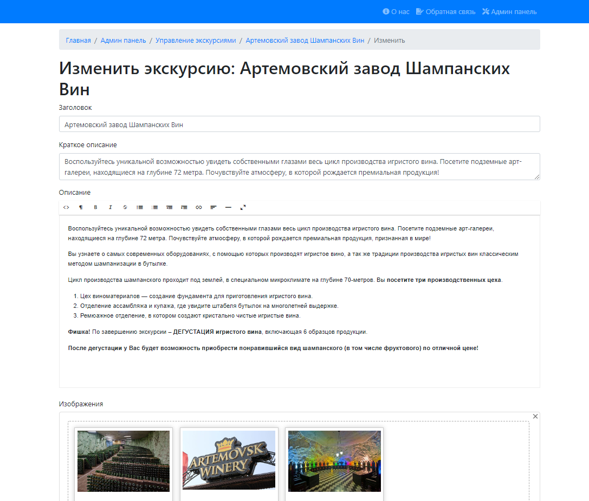

# Бахмутский центр туризма
## Дипломная работа, небольшой проект написанный на Yii2 на скорую руку. Краткий справочник достопримечательностей моего города с админкой.

## Установка

1. Выполнить команду `` composer install ``
2. Настроить подключение к базе данных в `` config/db.php ``
3.  Импортировать файл `` travel.sql ``

## Админка

Имя пользователя: `` admin ``

Пароль: `` admin ``